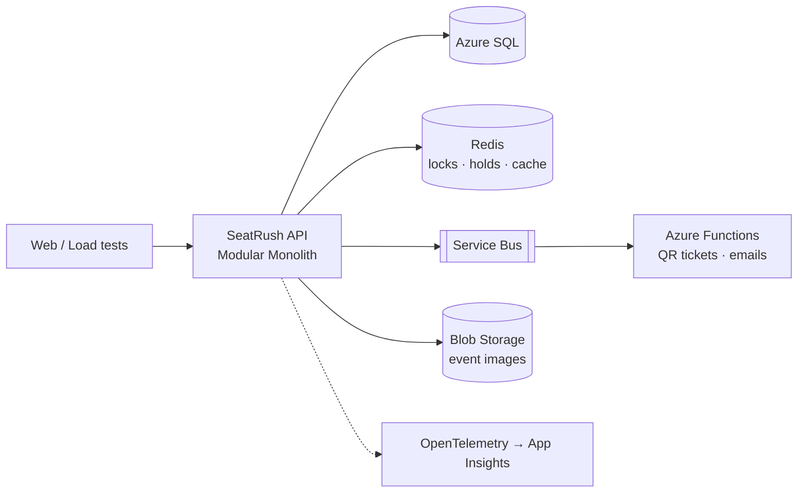

# SeatRush 🎟️

A production-grade event ticketing system built to explore **system design in .NET on Azure**: concurrency, caching, queues, reliability, and cloud, built in public.

> Thousands of users. A few hundred seats. Exactly one owner per seat.

---

## Why this exists

SeatRush is a learning lab for engineering at scale. Every feature exists to explore a real system design problem, and every claim is backed by **load tests, benchmarks, and failure experiments**, not just theory.

It is built with **AI as the dev team**: I own the architecture, make the decisions, review every change, and take responsibility for the result. AI writes most of the code under the rules in [`CLAUDE.md`](CLAUDE.md).

## The core problem

A popular event goes on sale. Thousands of people hit "Buy" at the same second for a limited number of seats. The system must:

- **Never double-book a seat**, even under heavy concurrency
- **Hold seats temporarily** during checkout and release them if abandoned
- **Survive traffic spikes** without falling over
- **Process payments safely**: no lost orders, no double charges
- **Stay observable**: when something breaks, find out why, fast

## Target architecture

**Modules:** Events · Booking · Payments · Notifications

## Tech stack

| Area | Tools |
|---|---|
| Backend | .NET, ASP.NET Core, EF Core |
| Data | SQL Server / Azure SQL, Redis |
| Messaging | Azure Service Bus, Outbox pattern |
| Cloud | Azure Container Apps, Functions, Blob Storage, Key Vault |
| DevOps | Docker, GitHub Actions, Terraform / Bicep, .NET Aspire |
| Observability | OpenTelemetry, Application Insights |
| Testing | xUnit, Testcontainers, k6 / NBomber |

## Roadmap

- [ ] **Phase 1: Foundations:** modular monolith skeleton, Events module, CI/CD to Azure
- [ ] **Phase 2: Booking under pressure:** seat holds, locking strategies, Redis
- [ ] **Phase 3: Payments & reliability:** idempotency, outbox, sagas, Polly
- [ ] **Phase 4: Async & cloud:** Service Bus, Functions, Blob Storage, notifications
- [ ] **Phase 5: Scale & observe:** caching, waiting room, load and chaos testing
- [ ] **Phase 6: Production-ready:** IaC, zero-downtime deploys, security, cost tuning

## Experiments & benchmarks

| # | Experiment | Result | Write-up |
|---|---|---|---|
| | *Coming soon* | | |

## Architecture decisions

Key decisions and their trade-offs are recorded as ADRs in [`docs/adr`](docs/adr).

## Running locally

*Coming in Phase 1:* one command with .NET Aspire.

## License

[MIT](LICENSE)
