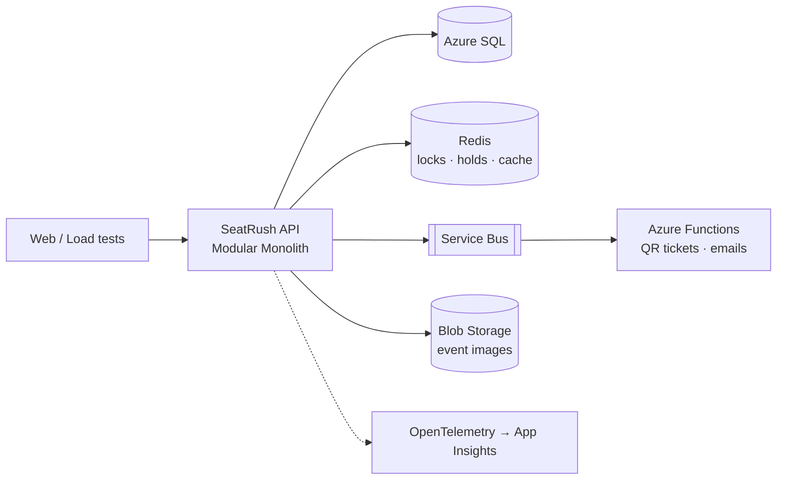

# SeatRush 🎟️

A production-grade event ticketing system built to explore **system design in .NET on Azure**: concurrency, caching, queues, reliability, and cloud, built in public.

> Thousands of users. A few hundred seats. Exactly one owner per seat.

---

## Why this exists

SeatRush is a learning lab for engineering at scale. Every feature exists to explore a real system design problem, and every claim is backed by **load tests, benchmarks, and failure experiments**, not just theory.

It is built with **AI as the dev team**: I own the architecture, make the decisions, review every change, and take responsibility for the result. AI writes most of the code under the rules in [`CLAUDE.md`](CLAUDE.md).

## The core problem

A popular event goes on sale. Thousands of people hit "Buy" at the same second for a limited number of seats. The system must:

- **Never double-book a seat**, even under heavy concurrency
- **Hold seats temporarily** during checkout and release them if abandoned
- **Survive traffic spikes** without falling over
- **Process payments safely**: no lost orders, no double charges
- **Stay observable**: when something breaks, find out why, fast

## Target architecture



**Modules:** Identity · Events · Booking · Payments · Notifications

## Tech stack

| Area | Tools |
|---|---|
| Backend | .NET, ASP.NET Core, EF Core |
| Data | SQL Server / Azure SQL, Redis |
| Messaging | Azure Service Bus, Outbox pattern |
| Cloud | Azure Container Apps, Functions, Blob Storage, Key Vault |
| DevOps | Docker, GitHub Actions, Bicep, .NET Aspire |
| Observability | OpenTelemetry, Application Insights |
| Testing | xUnit, Testcontainers, k6 |

## Roadmap

- [ ] **Phase 1: Foundations:** modular monolith skeleton, CI, Events module (local)
- [ ] **Phase 2: Booking under pressure:** identity, seat holds, locking strategies, Redis
- [ ] **Phase 3: Payments & reliability:** idempotency, outbox, sagas, Polly
- [ ] **Phase 4: Async & cloud:** first Azure deploy + CD, Service Bus, Functions, Blob Storage, notifications
- [ ] **Phase 5: Scale & observe:** caching, waiting room, load and chaos testing
- [ ] **Phase 6: Production-ready:** IaC, zero-downtime deploys, security, cost tuning

The detailed plan, current step, and decisions per phase are in [`docs/roadmap.md`](docs/roadmap.md).

## Experiments & benchmarks

| # | Experiment | Result | Write-up |
|---|---|---|---|
| | *Coming soon* | | |

## Architecture decisions

Key decisions and their trade-offs are recorded as ADRs in [`docs/adr`](docs/adr).

## Running locally

**Prerequisites:** .NET SDK 10.0.400+ and Docker Desktop (running).

**One-time setup:** choose a password for the local SQL Server container. SQL Server requires at least 8 characters, using three of: upper case, lower case, digits, symbols.

```bash
dotnet tool restore
dotnet user-secrets set "Parameters:sql-password" "<your-password>" --project aspire/SeatRush.AppHost
```

**Run:**

```bash
dotnet run --project aspire/SeatRush.AppHost
```

Aspire starts SQL Server and Redis in Docker, runs the `migrations` service (applies pending migrations, then exits), and starts the Api once migrations have succeeded. The dashboard link is printed in the console.

**The local database** keeps its data between runs (persistent container + data volume), with a stable connection string, e.g. for Rider:

```text
Server=127.0.0.1,14330;Database=seatrush;User ID=sa;Password=<your-password>;TrustServerCertificate=true
```

Don't change the password after the first run: SQL Server stores it in the data volume. To change it, reset the database.

**Reset to an empty database:** stop the AppHost, then remove the SQL Server container and its data volume. The next run creates both again and reapplies all migrations.

```bash
docker ps -a --filter "name=sql"        # find the container
docker rm -f <container>
docker volume ls --filter "name=sql"    # find the volume (ends with -sql-data)
docker volume rm <volume>
```

**Migrations** (each module owns its own, e.g. `src/Modules/Events/SeatRush.Events.Infrastructure/Persistence/Migrations`). `dotnet ef` uses the migration service as its startup project, which reads the connection string from its user-secrets. Store it once:

```bash
dotnet user-secrets set "ConnectionStrings:seatrush" "<connection string>" --project src/MigrationService/SeatRush.MigrationService
```

```bash
# Add a migration (example for the Events module)
dotnet ef migrations add <Name> \
  --project src/Modules/Events/SeatRush.Events.Infrastructure \
  --startup-project src/MigrationService/SeatRush.MigrationService \
  --output-dir Persistence/Migrations
```

The AppHost applies migrations automatically. To apply them by hand instead:

```bash
dotnet ef database update --project src/Modules/Events/SeatRush.Events.Infrastructure --startup-project src/MigrationService/SeatRush.MigrationService
```

## License

[MIT](LICENSE)
